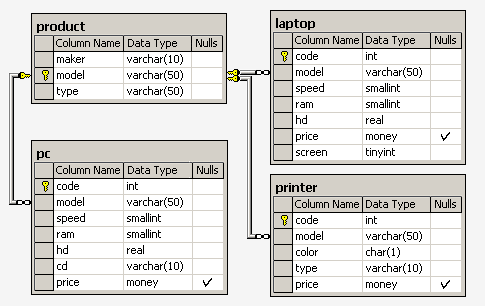
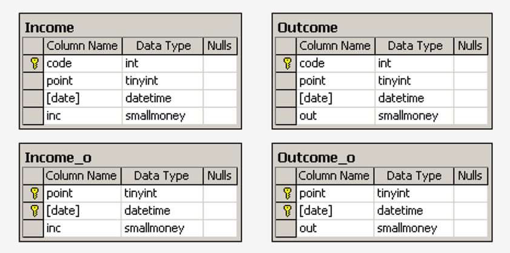
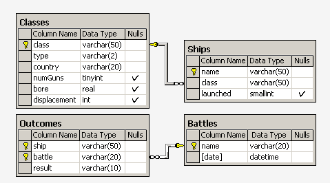

# Проект для демонстрации и улучшения навыков работы с PostgreSQL и SQLAlchemy

Этот проект создан с целью практики и улучшения навыков работы с PostgreSQL и SQLAlchemy.  

Задачи были взяты с проекта https://www.sql-ex.ru/  
Мои решения представлены в файле solutions.py, сами же упражнения можно найти в файле exercises.md.   
Для упрощения, в проекте используется одна база данных, где присутствуют таблицы из разных БД (с точки зрения
проектирования БД это неправильно, но данный проект не про это).

## Базы данных

- `computer_firm`:  

Схема БД состоит из четырех таблиц:  
Product(maker, model, type)  
PC(code, model, speed, ram, hd, cd, price)  
Laptop(code, model, speed, ram, hd, price, screen)  
Printer(code, model, color, type, price)  

Таблица Product представляет производителя (maker), номер модели (model) и 
тип ('PC' - ПК, 'Laptop' - ПК-блокнот или 'Printer' - принтер). Предполагается, что номера моделей в таблице 
Product уникальны для всех производителей и типов продуктов.  

В таблице PC для каждого ПК, однозначно 
определяемого уникальным кодом – code, указаны модель – model (внешний ключ к таблице Product), 
скорость - speed (процессора в мегагерцах), объем памяти - ram (в мегабайтах), 
размер диска - hd (в гигабайтах), скорость считывающего устройства - cd (например, '4x') и 
цена - price (в долларах).  

Таблица Laptop аналогична таблице РС за исключением того, что вместо скорости CD содержит размер 
экрана -screen (в дюймах).  

В таблице Printer для каждой модели принтера указывается, является ли он цветным - color ('y', если цветной), 
тип принтера - type (лазерный – 'Laser', струйный – 'Jet' или матричный – 'Matrix') и цена - price.
- `recycling_firm`:  

Фирма имеет несколько пунктов приема вторсырья. Каждый пункт получает деньги для их выдачи сдатчикам вторсырья.

Сведения о получении денег на пунктах приема записываются в таблицу:
Income_o(point, date, inc). Первичным ключом является (point, date). При этом в столбец date записывается 
только дата (без времени), т.е. прием денег (inc) на каждом пункте производится не чаще одного раза в день. 

Сведения о выдаче денег сдатчикам вторсырья записываются в таблицу: Outcome_o(point, date, out). 
В этой таблице также первичный ключ (point, date) гарантирует отчетность каждого пункта о выданных деньгах 
(out) не чаще одного раза в день.

В случае, когда приход и расход денег может фиксироваться несколько раз в день, используется другая схема с 
таблицами, имеющими первичный ключ code:
Income(code, point, date, inc)
Outcome(code, point, date, out).
Здесь также значения столбца date не содержат времени.
- `ships`: 

Рассматривается БД кораблей, участвовавших во второй мировой войне. Имеются следующие отношения:  
Classes (class, type, country, numGuns, bore, displacement)  
Ships (name, class, launched)  
Battles (name, date)  
Outcomes (ship, battle, result)  

Корабли в «классах» построены по одному и тому же проекту, и классу присваивается либо имя первого корабля, 
построенного по данному проекту, либо названию класса дается имя проекта, которое не совпадает ни с одним 
из кораблей в БД. Корабль, давший название классу, называется головным.

Отношение Classes содержит имя класса, тип (bb для боевого (линейного) корабля или bc для боевого крейсера), 
страну, в которой построен корабль, число главных орудий, калибр орудий (диаметр ствола орудия в дюймах) и 
водоизмещение ( вес в тоннах).  
В отношении Ships записаны название корабля, имя его класса и год спуска на воду.  
В отношение Battles включены название и дата битвы, в которой участвовали корабли.  
В отношении Outcomes – результат участия данного корабля в битве (потоплен-sunk, поврежден - damaged 
или невредим - OK).  

Для подробной информации о данных в таблицах каждой БД, перейдите в соответствующую директорию.

## Запуск проекта

Для создания таблиц и их заполнения необходимо перейти в соответсвующую директорию и запустить файлы
models.py (для создания таблиц) и add_data.py (для заполнения данными)

Решения некоторых задач представлены в файле queries.py 